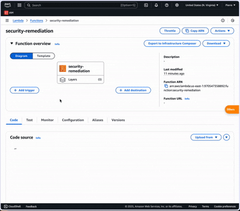

### AWS Cloud Security Management (CSPM) Terraform Setup

This repository contains a Terraform configuration for setting up AWS Cloud Security Management (CSPM) with the integration of AWS Lambda, CloudWatch, GuardDuty, and SecurityHub. The resources are configured to monitor, trigger, and remediate security threats on AWS.

### Overview

This setup creates and configures the following AWS resources:
	•	AWS Lambda: A serverless function to automate security remediations based on security alerts.
	•	AWS CloudWatch: Used to monitor and trigger events in AWS.
	•	AWS GuardDuty: An intelligent threat detection service to identify security risks.
	•	AWS SecurityHub: Provides a comprehensive view of security alerts and compliance status.
	•	AWS IAM Roles: Custom roles to provide the necessary permissions to Lambda and other services.
	•	AWS Config: Records AWS resource configurations and compliance statuses.

### Screenshot

  

### Resources Created
	•	Lambda Functions: Automates remediation for security alerts.
	•	CloudWatch Events: Triggers Lambda function based on GuardDuty alerts.
	•	IAM Roles and Policies: Controls access for Lambda and other services.
	•	GuardDuty Detector: Detects threats and generates alerts.
	•	SecurityHub: Manages security findings.

⸻

### Prerequisites
	•	💻 Terraform: Version 0.12 or above.
	•	🌐 AWS Account: You need an active AWS account.
	•	🔑 IAM Role with Permissions: The user must have the necessary IAM permissions to create and manage resources like Lambda, IAM roles, CloudWatch events, GuardDuty, and SecurityHub.

⸻

### Getting Started

#### Installation
	1.	Clone this repository:

	git clone https://github.com/your-username/aws-CSPM.git
	cd aws-CSPM

	2.	Install Terraform:
	If you haven’t installed Terraform yet, follow the installation instructions for your operating system:
	•	Install Terraform.
	3.	Configure AWS CLI:
	Make sure your AWS CLI is configured with the proper credentials:

	aws configure

	4.	Initialize Terraform:
	This command will initialize your Terraform working directory:

	terraform init

⸻

### Apply the Configuration
	1.	Run Terraform Plan: Review the actions Terraform will take to create resources:

	terraform plan

	2.	Apply the Configuration: Create the resources on AWS:

	terraform apply

	When prompted, type yes to approve the creation of resources.

⸻

### Lambda Function

#### Lambda Function Overview

The Lambda function (security-remediation) is designed to automatically take action on security alerts. This function is triggered by GuardDuty’s findings and performs remediation actions.
	•	Runtime: Node.js 16.x (or later)
	•	Function Name: security-remediation
	•	Handler: index.handler
	•	Memory Size: 128 MB
	•	Timeout: 3 seconds

#### Code Structure

The Lambda function expects a zip package that contains your Lambda code. The entry point is index.js, and the function logic will handle specific remediation actions based on the security alerts from GuardDuty.

⸻

### CloudWatch Events
 - Event Rule: The event rule is set to trigger whenever GuardDuty detects a threat. This triggers the Lambda function to execute and take appropriate action.

⸻

### Monitoring

To monitor your Lambda executions:
	1.	CloudWatch Logs:
	Logs will be sent automatically to CloudWatch for each Lambda execution. You can find the logs under the /aws/lambda/security-remediation log group in the CloudWatch console.
	2.	GuardDuty:
	The GuardDuty service continuously monitors your AWS environment for any potential security threats and sends findings that can trigger the Lambda function.
	3.	SecurityHub:
	All findings and alerts will be summarized and displayed in SecurityHub for a broader security overview.

⸻

### IAM Roles and Policies

This configuration automatically creates IAM roles and attaches necessary policies for the Lambda function. These roles will allow the Lambda function to execute and interact with other AWS services such as GuardDuty, CloudWatch, and SecurityHub.

IAM Roles Created
	•	Lambda Execution Role: Allows Lambda to perform actions on your behalf.
	•	Cloud Security Role: A dedicated role to manage security-related tasks.

⸻

### Lambda Package

The Lambda function is packaged into a zip file and referenced in Terraform:

lambda/security_remediation.zip

### To deploy your Lambda function:
	1.	Write your Lambda code in the lambda/ directory.
	2.	Zip the code: Make sure the zip file includes the index.js file and any necessary dependencies.

	cd lambda
	zip -r security_remediation.zip .

⸻

### GuardDuty Setup

GuardDuty will automatically begin monitoring your AWS environment for any security threats once enabled. It will trigger an event whenever a threat is detected and will send the alert to CloudWatch, which will then invoke the remediation Lambda function.

⸻

### Testing

After applying the Terraform plan, you can test the Lambda function by:
	1.	Manually invoking the function from the Lambda console with a test event.
	2.	Simulating a GuardDuty alert to see if the Lambda function is triggered.

⸻

### 📜 License

This project is licensed under the [MIT License](https://opensource.org/licenses/MIT) – feel free to use and modify!

⸻

### 🔹 Author: Pierre Mvita
-  🔗 GitHub: [Pmvita](https://github.com/Pmvita)
-  🔗 LinkedIn: [Pierre Mvita](https://www.linkedin.com/in/pierre-mvita)

⸻
